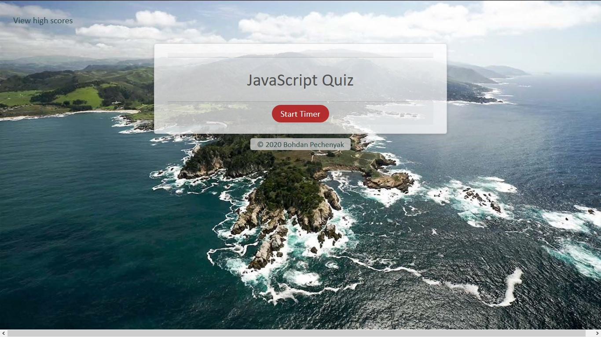
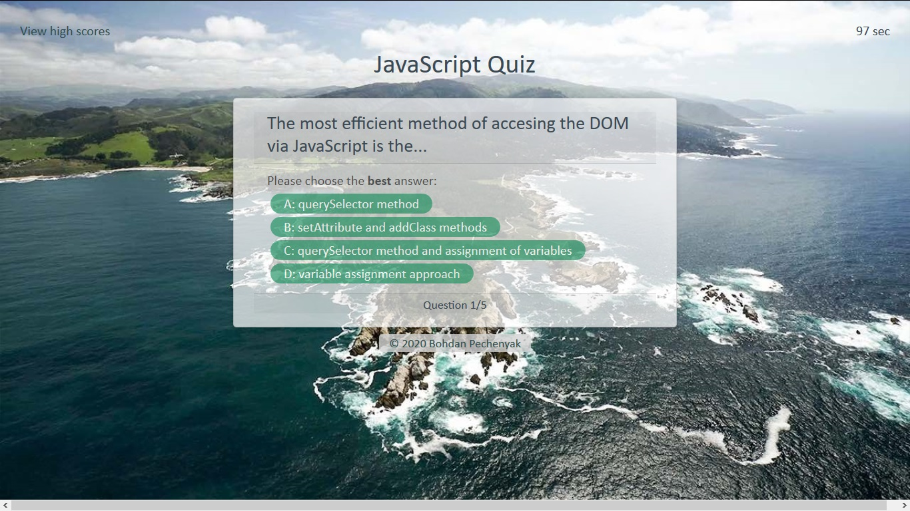
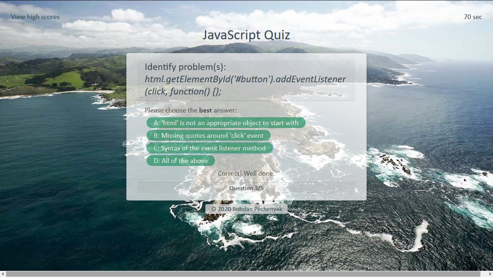
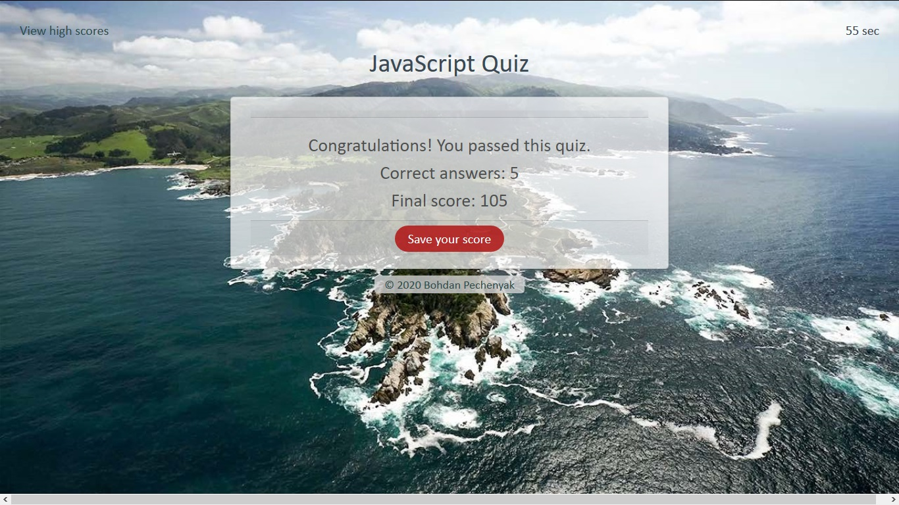

# JS-Quiz

A fully developed application for administering a quiz testing basic JavaScript knowledge:
* Semantic HTML tags and CSS attributes ensure an aesthetically pleasing and responsive layout that works across multiple device types 
* A timed quiz with penalty for wrong answers
* Final score calculated as a combination of time left and correct answers 
* High scores may be saved (using local memory) and a list of high scores may be viewed on a linked page
 
The application utilizes the following aspects: 
* variables and arrays (both of strings and of objects) 
* conditionals and loops (for, while)  
* multiple functions and preassigned methods (Web APIs - DOM, JSON) 
* access and manipulation of DOM objects (arrays, HTML elements, inner content)  

The functional core is built around the following:
* timing events (quiz timer)
* event handling 
    * "load" - initial content loaded dynamically
    * "click" - starting the quiz, advancing through the questions, and saving the scores
* manipulating local memory storage to save/retrieve data
* using JSON methods to manipulate an array of objects (high scores moved to/from local storage)

# Link to the finished project

[JavaScript Quiz](https://bohdicave.github.io/JS-Quiz)

# Screenshots

