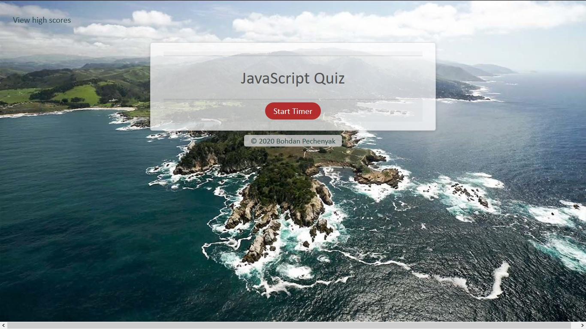
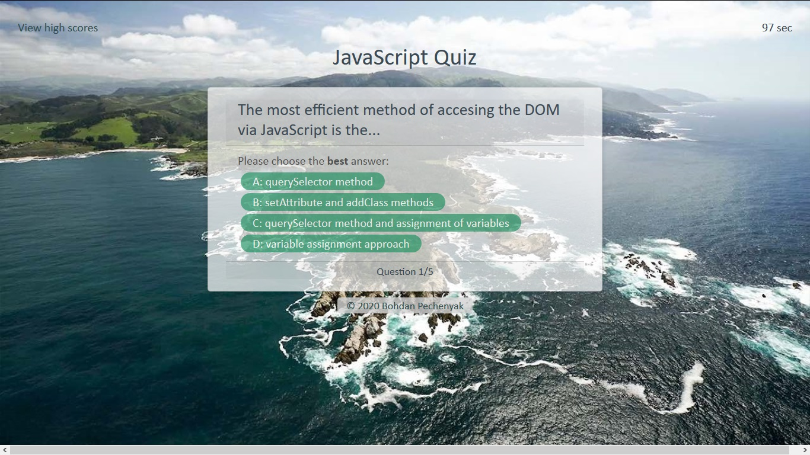
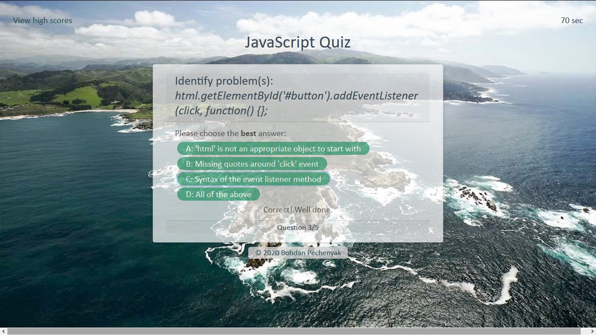
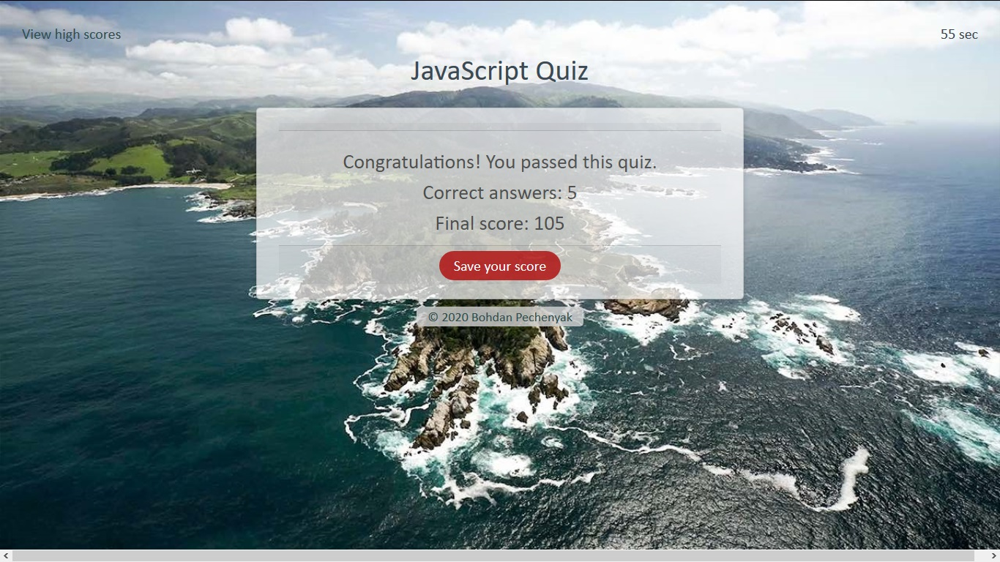

# JS-Quiz

* A fully developed application for testing JavaScript knowledge. 
* A timed quiz with penalty for wrong answers.
* The final score calculated as a combination of time left and correct answers. 
* The score may be saved (using local memory) and a list of high scores viewed.
 
The application utilizes variables and arrays (of strings, of objects), conditionals, loops (for, while),  multiple function sequences, and preassigned methods (Web APIs - DOM, JSON, others) to access and manipulate objects (arrays, DOM elements) to display and behave as needed. 

The functional core is built around timing events (quiz timer), event handling ("load" - to load the initial content dynamically, "click" - to start the quiz, advance through the questions, and save the scores), and manipulating local memory storage (high scores saved as an array of objects)

In addition, semantic HTML and CSS attributes ensure an aesthetically pleasing and responsive layout that works across multiple device types. 

